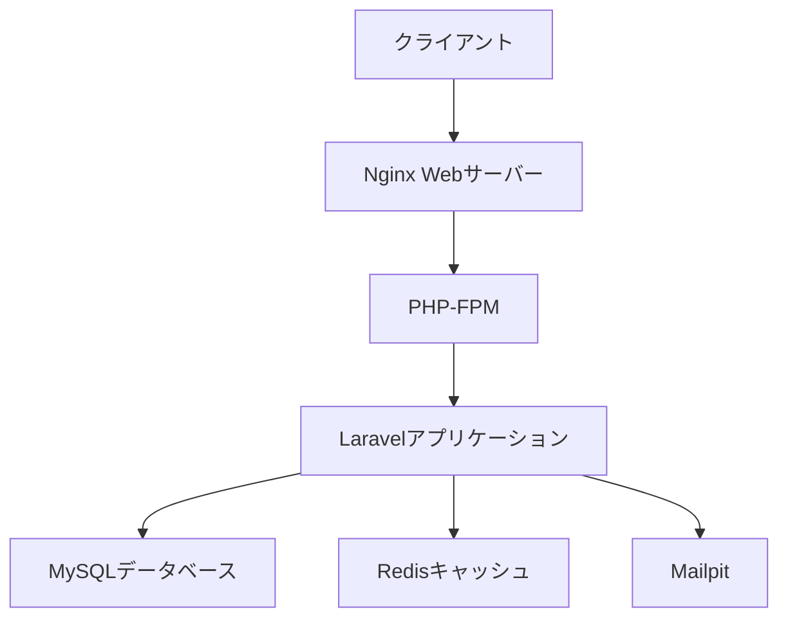

# アーキテクチャ設計

## システム構成

Laravel 12 Sandboxは以下のような構成で構築されています：



## コンテナ構成

| コンテナ名 | 説明 | ポート |
|------------|------|--------|
| app | PHPアプリケーション | 9005 |
| web | Nginxウェブサーバー | 8080 |
| db | MySQLデータベース | 3306 |
| redis | Redisキャッシュ | 6379 |
| mailpit | 開発用メールサーバー | 8025, 1025 |

## ディレクトリ構造

```
laravel12-sandbox/
├── src/               # Laravelアプリケーション
├── infra/             # インフラ設定
│   ├── php/          # PHP設定
│   ├── nginx/        # Nginx設定
│   └── mysql/        # MySQL設定
└── docker-compose.yml # Docker構成
```

## 開発環境の特徴

1. **Docker化**
   - 全てのサービスをコンテナ化
   - M1/M2 Mac対応（ARM64アーキテクチャ）
   - 開発環境の統一

2. **開発支援機能**
   - Xdebugによるデバッグ機能
   - Mailpitによるメール送信テスト
   - Redisによるキャッシュ管理

3. **CI/CD**
   - GitHub Actionsによる自動テスト
   - コード品質チェック
   - ドキュメントの自動デプロイ 